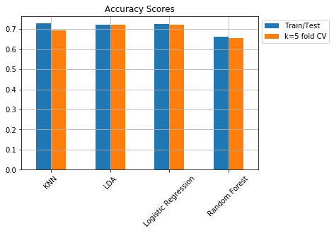

# What is the Fate of Marvel Characters? - An Attempt to Predict their Destinies with Characters' Traits using Classification Methods (by Taehyung Kim)

## Part 1: Project Background
#### As a fan of the Marvel Cinematic Universe,  I always found the scenes where each character met their fate so dramatic. Having learned of classification algorithms, I thought it'd be interesting to implement these methods to predict which characters live and which meet their demise, using some of their characteristics such as their alignment, eye & hair colors, and # of appearances in the comics. The dataset I used can be found here: https://www.kaggle.com/fivethirtyeight/fivethirtyeight-comic-characters-dataset?select=marvel-wikia-data.csv and the code can be found in the ipynb file in this same repository.

## Part 2: Data Cleaning
#### During this process, I attempted at the following:
#### - Observe the rows & columns and its unique values (16376 rows and 13 columns)
#### - Dropped columns other than the columns of interest- I used ID(characters' identity), ALIGN(whether the character is evil or not), EYE(eye color), HAIR(hair color), APPEARANCES(number of appearances) to predict ALIVE(living or deceased character) 
#### - Search for missing values (more than 50 percent of the data were missing)
#### - Replaced missing Appearance values with the column mean
#### - Decided to drop the other observations with missing values in columns other than Appearance- this decision was tough, but variables such as eye color and hair color were very difficult to generalize, as most characters have very distinct visual characteristics.
#### - The data, through cleaning was shortened into 5014 observations (30 percent of the total) and 7 columns

## Part 3: Exploratory Data Analysis
#### The following are my findings in this process:
#### - There are more Bad (Evil) Characters (Alignment) that have deceased than Good Characters, and overall more characters have survived than deceased.
#### - 
#### - The total number of appearances made by living characters (176,133 appearances) exceeds the total number of appearances made by deceased characters (33,190 appearances). 
#### - 
#### - There are more Bad Characters with a secret identities than there are Good Characters with secret identities. For all character alignments, the number of characters by identity follows the same descending order of Secret, Public, No Dual, and Known to Authorities Identities.
#### - 

## Part 4: Model Building and Evaluation
#### - First, I used Label Encoding on the Dependent Variable (ALIVE) so that 'Living Characters' are assigned 1s and 'Deceased Characters' are assigned 0s. (binary classification)
#### - Second, I conducted the train(80%)/test(20%) split to fit the data into 5 different classifiers: Logistic Regression, Quadratic Discriminant Analysis (QDA), Linear Discriminant Analysis (LDA), K-Nearest Neighbors (KNN), and Random Forest. For each of these, along with the train/test data plit method, I used k = 5 folds Cross Validation to acquire the confusion matrices and accuracy values. 
#### - The results show that Based on Train/Test data split method, KNN(k = 64) had the highest accuracy score. Based on k = 5 fold CV method, Logistic Regression had the highest accuracy score
#### - 

#### - Bonus: I added a row in the dataset of a Marvel Character named Peter Griffin from Family Guy, and used logistic regression to see if he lives - turns out he does!

## Part 5: Conclusion and Things that I've Learned (including limitations)
#### - The dataset does not reflect the latest changes on some characters (e.g [SPOILER ALERT] shows Iron Man as alive, not dead...Perhaps this is due to the dataset not reflecting the MCU but just the comicbooks)
#### - I only worked with 30 percent of the data due to missingness, and I think that results will vary once the missingness is solved
#### - One Hot Encoding and Label Encoding methods seem very useful for classification problems
#### - The QDA classifier performed notably lower than the others 
#### - In the next steps, I would like to further look for more efficient ways to add new observations of characters to predict their survival
#### - Can different values for cross validation (e.g k = 10 folds) yield different results? -> worth looking into.
#### - Why are LDA and Logistic Regression so close in their results? Could this be due to some of their characteristics?

## Part 6: Resources that I've Used and Learned From
#### - https://www.kaggle.com/fivethirtyeight/fivethirtyeight-comic-characters-dataset?select=marvel-wikia-data.csv -> dataset
#### - https://pandas.pydata.org/pandas-docs/stable/reference/index.html ->data manipulation and analysis with pandas (& LOTS of googling)
#### - https://seaborn.pydata.org/generated/seaborn.countplot.html -> sns grouped countplot
#### - https://python-graph-gallery.com/161-custom-matplotlib-donut-plot/ -> wedged donut plot
#### - https://matplotlib.org/3.1.1/api/_as_gen/matplotlib.pyplot.legend.html -> changing legend location
#### - https://towardsdatascience.com/categorical-encoding-using-label-encoding-and-one-hot-encoder-911ef77fb5bd -> label encoding and one hot encoding
#### - https://towardsdatascience.com/random-forest-in-python-24d0893d51c0 ->further on encoding
#### - https://towardsdatascience.com/accuracy-precision-recall-or-f1-331fb37c5cb9 -> different methods of evaluating classification models
#### - https://scikit-learn.org/stable/modules/model_evaluation.html -> different scoring parameters in sci-kit learn
#### - https://scikit-learn.org/stable/modules/generated/sklearn.model_selection.cross_val_score.html#sklearn.model_selection.cross_val_score -> cross_val_score
#### - (not used in this project, but still useful - negative MSE values in cross validation scoring) https://stackoverflow.com/questions/21443865/scikit-learn-cross-validation-negative-values-with-mean-squared-error
#### - (not used in this project, but still useful- cross_val_predict 1) https://scikit-learn.org/stable/modules/generated/sklearn.model_selection.cross_val_predict.html
#### - (not used in this project, but still useful- cross_val_predict 2) https://stackoverflow.com/questions/43613443/difference-between-cross-val-score-and-cross-val-predict
#### - (not used in this project, but still useful- cross_val_predict 3) https://stackoverflow.com/questions/41458834/how-is-scikit-learn-cross-val-predict-accuracy-score-calculated
#### - https://stackoverflow.com/questions/47796264/function-to-create-grouped-bar-plot ->grouped bar plot using pivot
#### - https://pythonexamples.org/pandas-dataframe-add-append-row/ -> add new row in pandas
